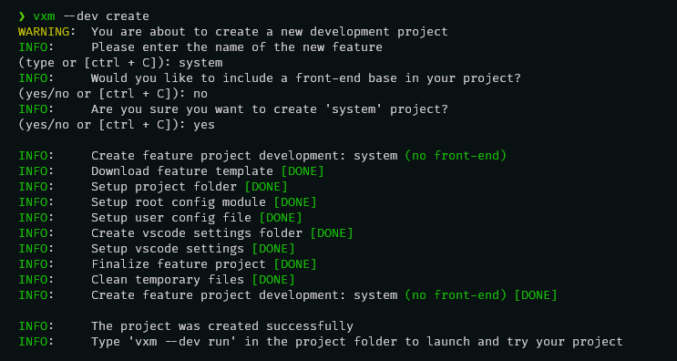

# { width=64 style="vertical-align: -40%; margin-right: 10px;" } Vixen Shell Features

## Create a feature

Creating a new feature with Vixen Shell is similar to starting a development project. The `vxm` command-line tool provides the necessary commands for managing these projects.

- To create a new feature, first navigate to the directory where you want to create your project. Open a terminal and type the following command:

    ``` bash
    vxm --dev create
    ```

    
- Enter the name of your feature. If an existing feature in Vixen Shell has the same name, you will be prompted to choose a different one.
- Then, decide whether you want to include a front-end base in your project.
- Finally, validate your choices.

    !!! terminal_success "Your new feature project has just been created !"
        
        Here we have just created a development project for a Vixen Shell feature without a front-end base.

    !!! info "Now you can open your project using your preferred IDE or text editor."
        I personally recommend using Visual Studio Code because it comes with integrated configuration by Vixen Shell for development projects, providing autocomplete to enhance your workflow.

    !!! info "You can choose between two types of features."
        You can choose between two types of features: **with** or **without** front-end user interfaces. To do this, simply answer *'yes'* or *'no'* to the second question *'Would you like to include a front-end base in your project?'*.

After creating your project, you can launch it in development mode to visualize and test the outcome of your work.

- To do this, navigate to your project directory:

``` bash
cd vx-feature-[feature name]
```

- Then, once inside your project directory, execute the following command:

``` bash
vxm --dev run
```

!!! files "Project tree structure"
    * :fontawesome-solid-caret-down:vx-feature-[feature name]
        * :fontawesome-solid-caret-down:.vscode
            * settings.json
        * :fontawesome-solid-caret-down:root
            * :fontawesome-solid-caret-right:[feature name]
                * \__init__.py
        * :fontawesome-solid-caret-down:user
            * [feature name].json
        * .gitignore
        * LICENSE
        * README.md
