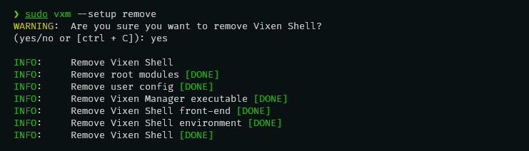

# { width=64 style="vertical-align: -40%; margin-right: 10px;" } Install Vixen Shell

??? quote "Prerequistes"
    Before getting started with **Vixen Shell**, make sure you have the following:

    1. **Operating System**:
        - A Linux distribution compatible with Wayland (e.g., Ubuntu, Fedora, Arch Linux, Manjaro Linux).

    2. **Window Manager**:
        - Sway, Hyprland, or any other window manager compatible with Wayland.

    3. **Languages and Technologies**:
        - **Python**: Ensure Python is installed (version 3.11 or higher).
        - **yarn**: For managing dependencies and building front-end components.

    4. **Development Tools**:
        - A code editor or IDE (Visual Studio Code is recommended).
        - Git for version control (Recommended).

    5. **Permissions and Access**:
        - Administrator or superuser access to install certain dependencies and perform system configurations.

## Install

!!! info "Yarn"
    - Before proceeding with the installation, ensure that Yarn is installed on your system. You can check if Yarn is installed by running the following command in your terminal:

        ``` bash
        yarn --version
        ```

    - If Yarn is not installed or if the command returns an error, you can install Yarn using the appropriate method for your system.

        ``` bash title="Arch Linux based distribution"
        sudo pacman -S yarn
        ```

- Go to the **Vixen Shell repository** and download the project archive in ZIP format.

<div class="grid cards" markdown>

- :simple-git: [__Vixen Shell Repository__](https://github.com/vixen-shell/vixen-shell){style="margin-left: 16px;"}
- :octicons-download-16: [__Download Vixen Shell Archive__](https://github.com/vixen-shell/vixen-shell/archive/refs/heads/main.zip){style="margin-left: 16px;"}

</div>

- Once the download is complete, locate the ZIP file in your download folder. Right-click on the archive and select the option to extract the files. You can also use the command line:

    ``` bash
    unzip vixen-shell-main.zip
    ```

- After extracting the files, navigate to the newly created directory:

    ``` bash
    cd vixen-shell-main
    ```

- In the extracted directory, run the installation script as an administrator with the following command:

    ``` bash
    sudo ./install
    ```

- Confirm your choice and this script will install Vixen Shell on your system.

    ??? terminal_success "All set! Vixen Shell is installed."
        

## Post-install

* To start, you can verify that Vixen Shell starts correctly by running the following command in a terminal:

    ``` bash
    vxm --shell open
    ```
    ??? terminal_success "If everything is working properly, Vixen Shell should start without any errors."
        
        Type CTRL+C to exit Vixen Shell ...

* ### System Extra Feature
    
    Next, I recommend installing the additional **system** feature of Vixen Shell by running the following command:

    ``` bash
    vxm --features add --extra system
    ```
    This feature allows you to obtain information and execute commands on your system.

    !!! note
        At the moment, the 'system' feature is still relatively limited, but it will be expanded in the future.

* ### Hyprland Extra Feature

    For Hypreland user, I strongly recommend installing the additional **hypland** feature. It will allow you to retrieve extensive information about the window manager as well as access to the UNIX socket that continuously broadcasts Hyprland events.

    ``` bash
    vxm --features add --extra hyprland
    ```

* ### Vixen Shell Startup

    To finish, all you need to do is configure Vixen Shell to start automatically when your window manager starts. (e.g., startup script, window manager configuration file - adapt the method according to your window manager or configuration)

    Under Hyprland, you simply need to edit the configuration file (hyprland.conf) and add the following line to your startup section:

    ``` title="hyprland.conf"
    exec-once = vxm --shell open
    ```

## Uninstall Vixen Shell

- To uninstall Vixen Shell from your system, simply type the following command:

    ``` bash
    sudo vxm --setup remove
    ```

- Confirm your choice ...

    ??? terminal_success "Of course, Vixen Shell will be completely uninstalled."
        